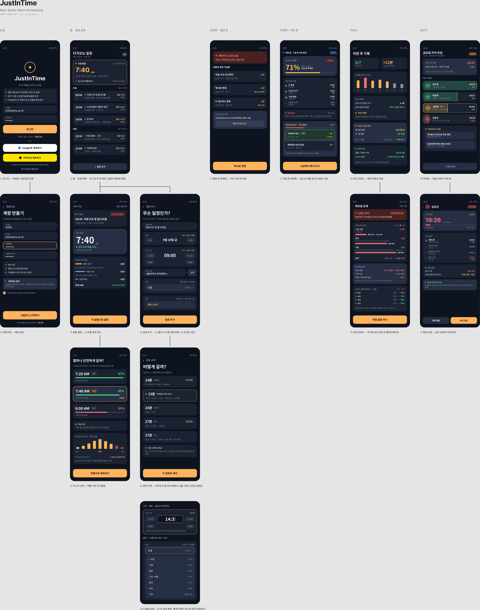

# JustInTime

[](https://github.com/snuhcs-course/swpp-2026-project-team-18/actions/workflows/ci.yml)

**An alarm you set by arrival confidence, not by clock time.**

A normal alarm makes you pick "7:40". But what you actually want to decide is not a
time — it is *how sure you want to be that you won't be late*. JustInTime works
backwards from when your event starts, subtracting `prep time + travel time + safety
buffer`, and **shows you the reasoning behind the number**.



> All 13 Figma screens, plus one input-state fragment of the add-event screen.
> Columns are stages; screens below a frame are its children.

---

## Features

| | Feature | Status |
| --- | --- | --- |
| ✅ | **Backward alarm calculation** — event start − buffer − travel − prep | Done |
| ✅ | **Real travel times from Kakao** — actual route lookup from home to destination | Done |
| ✅ | **Route selection** — pick from the candidates Kakao returns, e.g. 23 min with one transfer vs. 27 min with none | Done |
| ✅ | **Visible reasoning** — prep / travel / buffer broken out, with each value labeled as measured or fixed | Done |
| ✅ | **Per-category safety margin (τ)** — exams, presentations and trains wake you earlier | Done |
| ✅ | **Learning from your mornings** — one tap per prep block records how long it took and how much slack you had; the server shifts the distribution | Done |
| 🚧 | **On-time probability** — the pipeline is complete end to end, but it stays blank until enough observations exist. The UI says why instead of guessing | Learning |
| ✅ | **Exact alarm delivery** — `setAlarmClock` (survives Doze, shows the system next-alarm icon), full-screen intent over the lock screen, re-registration after reboot, app update and clock changes | Done |
| 🚧 | **Replanning** — alternatives when you're already running late | Planned |
| 🚧 | **Group rooms** — see everyone's expected arrival together | Planned |

### Why the probability is blank

Showing an on-time probability requires a **distribution of travel times**. Kakao's
routing response has no variance information — just a single `totalTime` point
estimate — and there are no user observations yet.

So the probability field is left empty and the UI says "learning" instead. Filling in
an arbitrary 90% would make the screen look finished while being untrue. Once
observations accumulate, the value is computed from quantiles.

---

## Tech Stack

| Layer | Choice |
| --- | --- |
| App | Native Android · Kotlin · **Jetpack Compose** · Material3 |
| State | `ViewModel` + `StateFlow` + Coroutines |
| Networking | Retrofit + Gson + OkHttp |
| On-device storage | Room (offline cache of server responses) + WorkManager (background sync) |
| Server | **Django + Django REST Framework** |
| Database | **Neon Postgres — one database for both development and deployment** |
| Auth | SimpleJWT (email + password) |
| External APIs | Kakao Map (routing, place search), OpenAI, KMA weather, FCM |
| Design | Figma |

We did not use a cross-platform framework (Flutter, React Native). The core of this
app is **exact alarm delivery** — `AlarmManager.setAlarmClock`, Doze exemptions,
full-screen intents, re-registration after reboot. Those need direct platform access,
and putting a plugin layer in between makes them harder to debug.

---

## Getting Started

The app does not work on its own. **Start the backend first.**

### Prerequisites

- Android Studio (2025.1 or newer) with Android SDK 37
- An emulator or device running **Android 14 (API 34) or newer**
- Python 3.12
- JDK — the JBR bundled with Android Studio is fine
- A Kakao REST API key ([how to get one](#api-keys))

### Installation

**1. Backend**

```powershell
cd backend

# first time only
python -m venv .venv
.\.venv\Scripts\python.exe -m pip install -r requirements\dev.txt
Copy-Item .env.example .env      # then fill in the keys
.\.venv\Scripts\python.exe manage.py migrate

# run — must bind 0.0.0.0 so the emulator can reach it
.\.venv\Scripts\python.exe manage.py runserver 0.0.0.0:8000
```

Binding to `127.0.0.1:8000` works from the host but **the emulator cannot connect**.

Demo account: `demo@demo.com` / `demo1234` (created only when `DEBUG=True`).
Admin site: `http://127.0.0.1:8000/admin/`.

**2. App**

```powershell
cd APP
$env:JAVA_HOME="C:\Program Files\Android\Android Studio\jbr"
.\gradlew.bat assembleDebug
.\gradlew.bat installDebug
```

From an emulator the host machine is `10.0.2.2`, and the app resolves that at runtime,
so no configuration is needed. For a physical device put your machine's LAN IP in
`local.properties` (git-ignored):

```properties
devServerHost=192.168.0.12
```

`APP/scripts/use_device.ps1` fills that in for you and checks the firewall and the
connected device. You do not have to undo it to go back to the emulator — the app
detects one and substitutes `10.0.2.2`, so a single build works on both.

**See [docs/device-setup.md](docs/device-setup.md)** for the full walkthrough,
including permissions, battery optimization and testing an actual commute.

**3. Emulator setup**

Skip these and you will mistake them for app bugs.

```powershell
# Time zone. The default is GMT, which puts every displayed time 9 hours off.
adb shell cmd alarm set-timezone Asia/Seoul

# Soft keyboard. In hardware-keyboard mode no on-screen keyboard appears and the
# host keyboard sends raw ASCII, so Hangul never gets composed.
adb shell settings put secure show_ime_with_hard_keyboard 1
```

For Korean input, add the language under **Settings → Languages → Add a language →
한국어(대한민국)**. Gboard ships with English only, so Hangul cannot be typed until
you do.

### Using the app

```
Sign in → set home location → add an event → choose a route → see the alarm
```

The home location is the origin for every travel-time lookup. Without it the alarm
cannot be computed; the banner on the home screen takes you straight to the setting.

---

## Project Structure

```
├── APP/                        Android (Kotlin + Compose)
│   └── app/src/main/java/com/swpp/wakeup/
│       ├── alarm/              AlarmManager scheduling, full-screen alarm, boot re-register
│       ├── background/         WorkManager — observation upload, plan sync
│       ├── calendar/           device calendar reader (CalendarContract)
│       ├── data/               remote (Retrofit) · local (Room cache, prefs) · repositories
│       ├── domain/model/       view-facing models
│       ├── sensing/            departure / arrival detection, upload queues
│       └── ui/                 auth · onboarding · home · events · routines · alarm
│                               · morning · report · calendar · common · nav · theme
├── backend/                    Django + DRF
│   ├── apps/
│   │   ├── accounts/           User · Profile
│   │   ├── events/             Place · EventTag · Event · calendar import
│   │   ├── routines/           RoutineBlock, per-event checks, block observations
│   │   ├── planning/           AlarmPlan, distributions, estimators
│   │   ├── prediction/         parameter learning from observations
│   │   ├── observations/       TripObservation (real departure / arrival times)
│   │   ├── reports/            weekly report, probability calibration
│   │   ├── routing/            Kakao clients
│   │   └── common/             shared error format
│   └── scripts/                API verification scripts (see run_local_suite.py)
├── .github/workflows/ci.yml    backend tests · contract checks · app build
└── docs/                       guides and images referenced from this README
```

`docs/` holds what you need to run the project:

- **[Team setup](docs/team-setup.md)** — shared server and database, verification
  scripts, CI, and how to tell whether the deployed code is stale
- **[Running on a physical device](docs/device-setup.md)** — network setup, pairing,
  permissions, and how to test a commute when the dev server stays at home
- `screens-overview.png` — the Figma board capture used above

Design documents (specifications, checklists, proposal drafts) are kept out of the
repository on purpose and shared through the course **Wiki**.

---

## Verification

Three suites, all runnable locally. CI runs the same three on every push and pull
request ([`.github/workflows/ci.yml`](.github/workflows/ci.yml)).

```bash
cd backend && python -m pytest                       # 606 unit tests
cd backend && python scripts/run_local_suite.py      # 8 HTTP suites against a live server
cd APP     && ./gradlew testDebugUnitTest lintDebug assembleDebug   # 340 tests + lint + build
```

The middle one is the unusual part. `scripts/check_*.py` drive a **running** Django
server over HTTP, which catches what the Django test client does not: a URL that was
never wired up, a serializer field the app reads under a different name, a permission
class that was left off. `run_local_suite.py` starts the server, shuts it down
afterwards, and refuses to run if port 8000 is already taken — a stale server
answering health checks once made an entire suite pass against old code.

It also pins the database to a **throwaway SQLite file in the temp directory**, never
the team's Neon database. These scripts create close to a hundred accounts per run,
and Neon is the only copy of the team's data. The same reasoning applies to `pytest`,
which uses in-memory SQLite: neither is a second database to maintain, both exist only
while the checks run.

No secrets are needed. Without `KAKAO_REST_API_KEY` the checks that require route
lookups are **skipped rather than failed**, so CI never burns the daily free quota
that the team needs for development.

---

## API

```
POST  /api/auth/register              sign up
POST  /api/auth/token                 sign in (access + refresh)
POST  /api/auth/token/refresh         refresh
GET   /api/auth/me                    validate the stored token

GET   PATCH  /api/profile             home location, prep time, default τ

GET   POST   /api/events              list, create
GET   PATCH  DELETE  /api/events/{id}
POST  /api/events/{id}/recompute      recalculate the alarm only
GET   /api/events/tags                the six event categories

GET   /api/places/search?q=           Kakao place search (proxied, paged, sortable)
GET   /api/places/staticmap           Kakao static map tile (proxied, cached)
GET   /api/routes/candidates          route candidates

POST  /api/observations/batch         upload detected departures / arrivals
GET   /api/observations               list, filterable by event, kind and time
```

`/api/observations/batch` is idempotent on `(user, client_uuid)`. Detection happens
mid-commute where there is often no network, so the app queues records on disk and
resends them; a retry must not create a second row.

**The app never calls Kakao directly.** An API key shipped in an APK can be extracted,
so the server proxies those calls.

`/api/places/search` reports `reachable_count` rather than Kakao's `total_count`.
Kakao answers "카페" with 142,759 matches but only serves 45 of them, so the larger
number next to a list that ends at 45 reads as a bug. Ratings and photos are not in
the response at all, so each result carries `place_url` instead of an invented score.
`/api/places/staticmap` returns a rendered PNG and caches it for an hour — the free
quota is 1,000 requests a day and panning a map would burn that in minutes. Failures
are not cached, or a map would stay blank for an hour after Kakao recovered.

### Verification

Every script makes real HTTP calls. Run them with the server up.

```powershell
cd backend
.\.venv\Scripts\python.exe scripts\check_auth_api.py          # auth, 18 cases
.\.venv\Scripts\python.exe scripts\check_events_api.py        # events, 28 cases
.\.venv\Scripts\python.exe scripts\check_route_api.py         # routes, 33 cases
.\.venv\Scripts\python.exe scripts\check_observations_api.py  # observations, 29 cases
.\.venv\Scripts\python.exe scripts\db_status.py               # database summary
```

The app side has unit tests for the logic that cannot be checked by hand — the
departure and arrival decisions, where blurry fixes and stray coordinates have to be
reproduced deliberately:

```powershell
cd APP
$env:JAVA_HOME="C:\Program Files\Android\Android Studio\jbr"
.\gradlew.bat testDebugUnitTest
```

---

## API Keys

Put them in `backend/.env`, copied from `.env.example`.
**`.env` is never committed** (see `.gitignore`).

| Variable | Where to get it | Notes |
| --- | --- | --- |
| `KAKAO_REST_API_KEY` | [developers.kakao.com](https://developers.kakao.com) | One key covers transit, walk, bicycle, car and place search |
| `OPENAI_API_KEY` | [platform.openai.com](https://platform.openai.com) | Natural-language event parsing (planned) |
| `KMA_API_KEY` | [KMA API Hub](https://apihub.kma.go.kr) | Short-term forecast; requires an access request |
| `FCM_CREDENTIALS_PATH` | Firebase console | A **path** to the JSON. Keep the file outside the repository |

Kakao Map needs no review process — just switch it on under
`My Application > Product Settings > Kakao Map`. **The free quota applies to only one
app per developer account, so the team should create a single app and share the key.**

---

## Team

SNU SWPP 2026 Fall · Team 18
