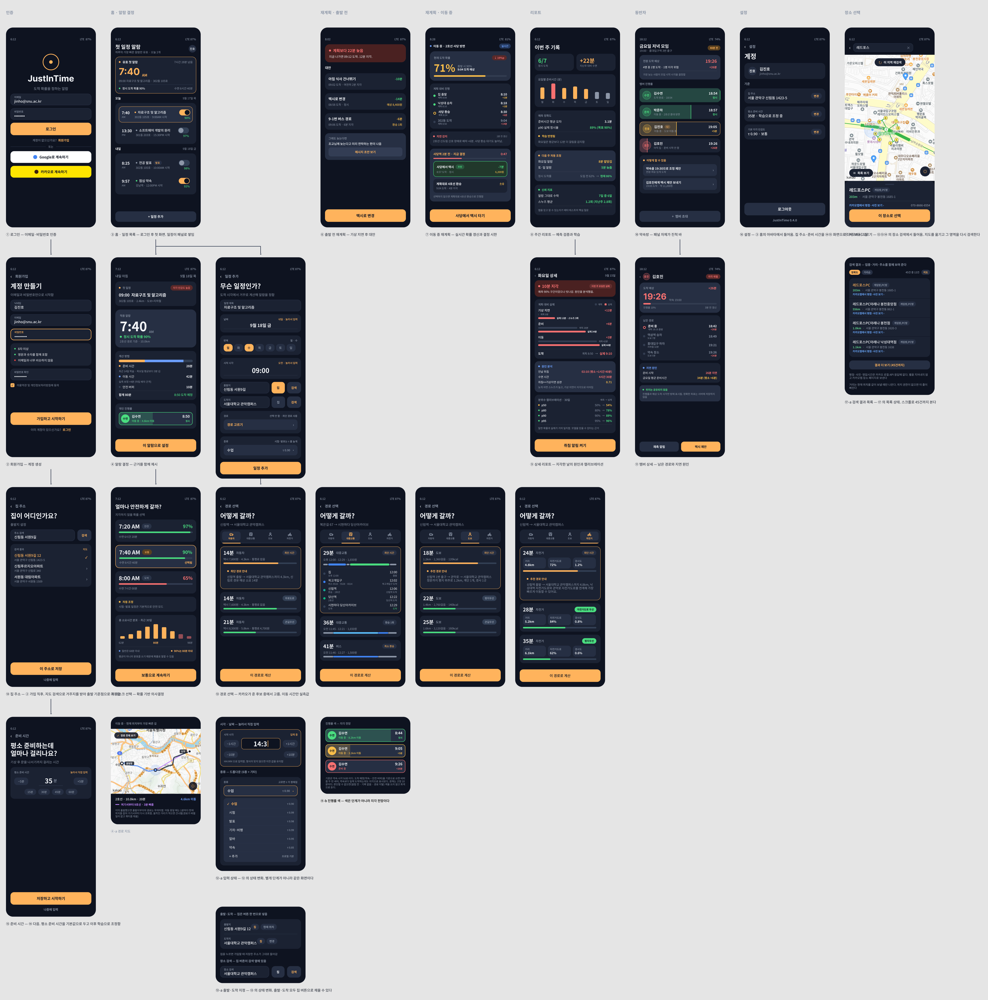

# JustInTime

[](https://github.com/snuhcs-course/swpp-2026-project-team-18/actions/workflows/ci.yml)

**An alarm you set by arrival confidence, not by clock time.**

A normal alarm makes you pick "7:40". But what you actually want to decide is not a
time — it is *how sure you want to be that you won't be late*. JustInTime works
backwards from when your event starts:

```
alarm = event start − safety buffer (10 min) − τ-quantile of (prep + travel)
```

τ is the confidence you ask for — 0.90 for a class, 0.99 for an exam or a train. The
app **shows the reasoning behind the number**: what was measured (a Kakao route of
20 min, 4.6 km, one transfer), what is fixed (the buffer) and what was learned from
your own mornings.

| | |
| --- | --- |
| Version | **0.9.0** — server `APP_VERSION` and app `versionName` |
| Shared server | `https://justintime-api.onrender.com` ([`/api/health`](https://justintime-api.onrender.com/api/health)) |
| Stack | Android · Kotlin · Jetpack Compose — Django · DRF · Neon Postgres — Render |



> The Figma board as of 2026-09-30: 17 screens plus state variants (route map,
> progress colors, route modes, input states). Columns are stages; screens below a
> frame are its children. The board is ahead of the app in places — the lists below
> describe the app.

---

## Features

What works end to end in 0.9.0:

1. **Sign up and onboard** — email and password, home address, usual prep time
2. **Add an event** — title, time, category (which sets τ), destination (Kakao place
   search or a pick on the map), origin (home by default), and a route chosen from
   Kakao's candidates: transit, walk, bicycle or car
3. **See the alarm and why** — the server computes it; the decision screen breaks out
   prep, travel and buffer, each labeled as measured or fixed, with a progress bar and
   a route map. A faster alternative from the origin is drawn on the map
4. **Wake up reliably** — `setAlarmClock` (survives Doze, shows the system next-alarm
   icon), full screen over the lock screen, re-registered after reboot, app update and
   clock changes, 5-minute snooze. Alarms for the next 7 days are registered
5. **Log the morning** — dismissing the alarm starts one-tap-per-block prep logging and
   GPS trip tracking
6. **Commute** — departure and arrival are detected on the device (arrival = within
   50 m of the destination for 2 minutes). While you are moving, the app fetches the
   fastest route from your current position every minute and draws it in purple; the
   progress bar shows a live ETA and colors the lateness outlook
7. **Learn** — departures, arrivals and prep blocks are uploaded, queued on disk while
   offline. Prep observations feed the next calculation directly
8. **Review** — weekly report and calibration: did you arrive as often as τ promised?

Also: Seoul subway and bus real-time arrivals on the route (express, last train,
congestion), device calendar import, an offline cache and background sync (plans every
6 hours, routes every 15 minutes for events within 3 hours).

### Why the probability is blank

An on-time probability needs a **distribution** of travel times. Kakao returns a single
`totalTime` with no variance, so the spread has to come from your own trips — route
corrections learned from observed departures and arrivals. Until that evidence exists,
the field stays empty and the screen says "learning". Filling in an arbitrary 90% would
make the screen look finished while being untrue.

---

## Known limitations and todos

**Partial**

- On-time probability *value* — the pipeline is complete; the value waits for travel
  variance evidence (above)
- Risk choice ⑤ — an explanation screen only, no per-time probability options yet
- Replanning while moving ⑦ — colors, ETA and the live route; no checkpoints or causes
- Route choice — one list; the per-mode tabs on the board (⑬) are not in the app
- Weekly and detailed reports ⑧⑨ — part of the board is implemented
- Sign-in — email and password only; the social buttons show a notice, no terms consent
- Route learning — corrections update only when someone runs
  `python manage.py train_models`; there is no scheduler on Render's free plan

**Not started**

- Replanning before departure ⑥ and a "switch to this route" action
- Group rooms ⑩⑪
- Editing a saved event — the server's `PATCH /api/events/{id}` recomputes, but the
  app has no edit screen
- Adjusting τ directly, natural-language input, weather adjustment, push (FCM),
  bedtime suggestions
- Encrypted token storage — tokens sit in plain SharedPreferences; required before a
  real release
- Battery-optimization guidance

**Known bugs** (found in review, not fixed yet)

1. "Fastest route" is the fastest within the chosen mode, not across modes — the scope
   is still to be decided
2. The arrived state does not stay on screen
3. When the tracking service restarts, the moving state and the live route are lost
4. Map panning can jump twice as far during consecutive gestures while a response is slow
5. A small pinch (12%) snaps a whole zoom level

---

## Getting started

### Run the app

No backend setup is needed. Every build talks to the shared server (`jitApiBaseUrl` in
[`APP/gradle.properties`](APP/gradle.properties)), so anyone who clones the repository
sees the same data.

- Android Studio with Android SDK 37 (the project uses AGP 9.3 and Gradle 9.5; Gradle
  downloads the JDKs it needs)
- An emulator or device running **Android 14 (API 34) or newer**

```bash
cd APP
./gradlew assembleDebug        # Windows: .\gradlew.bat assembleDebug
./gradlew installDebug
```

The build log prints `[JustInTime] API=...` — the server that build talks to. If Gradle
cannot find a JDK, point `JAVA_HOME` at the JBR bundled with Android Studio.

Sign in with the demo account `demo@demo.com` / `demo1234`, or create one.

The shared server runs on Render's free plan and sleeps after 15 minutes without
traffic. The first request then takes 30–60 seconds; the app wakes the server with a
health check and says so on screen.

**Emulator setup** — skip these and you will mistake them for app bugs.

```bash
# Time zone. The default is GMT, which puts every displayed time 9 hours off.
adb shell cmd alarm set-timezone Asia/Seoul

# Soft keyboard. In hardware-keyboard mode no on-screen keyboard appears and the
# host keyboard sends raw ASCII, so Hangul never gets composed.
adb shell settings put secure show_ime_with_hard_keyboard 1
```

For Korean input, add **Settings → Languages → Add a language → 한국어(대한민국)**.

**Physical devices** — see [docs/device-setup.md](docs/device-setup.md) for USB and
wireless debugging, permissions and battery settings. Test devices against the shared
server; that guide's "local server" section predates it.
[`APP/scripts/`](APP/scripts/README.md) has PowerShell helpers for installing and
checking a device.

### Work on the backend

```bash
cd backend
python -m venv .venv
source .venv/bin/activate          # Windows: .venv\Scripts\activate
pip install -r requirements/dev.txt
cp .env.example .env               # Windows: copy .env.example .env
python -m pytest                   # 717 tests — in-memory SQLite, no keys needed
```

Unit tests need nothing else. Running the server needs `DATABASE_URL` and the API keys
in `.env` ([Configuration](#configuration)); the values come from the team and are never
committed. The dev settings refuse to start without `DATABASE_URL`.

> **`DATABASE_URL` is the team's shared Neon database** — the one the deployed server
> uses. `runserver`, `migrate` and scripts run locally write team data. Run
> `python scripts/backup_db.py` before anything destructive.

To try server changes in the app before deploying, run the server locally and point an
emulator build at it with a git-ignored `APP/local.properties` line. Remove the line and
rebuild to go back to the shared server.

```bash
python manage.py runserver 0.0.0.0:8000
```

```properties
devServerHost=10.0.2.2
```

---

## Architecture

App — one direction only, `ui → ViewModel → repository → remote/local`:

```
ui/                        Compose screens
  ↑ StateFlow   ↓ actions
HomeViewModel · AuthViewModel
  ↓
data/repository            → data/remote (Retrofit) · data/local (Room cache, SharedPreferences)
domain/model               pure calculations and view models, covered by JVM tests
alarm/ sensing/ background/   receivers, the trip-tracking foreground service, WorkManager workers
```

Server — the app talks to it only over HTTPS with JWT:

```
accounts · events · routines · observations · reports    views and serializers
  ↓
planning     alarm calculation (compute_and_store)
  ↓
routing      Kakao routes, places, static maps · Seoul subway and bus real-time
prediction   learning from observations (manage.py train_models)
  ↓
Neon Postgres
```

Creating or changing an event runs the calculation on the server: resolve the route
with Kakao, estimate the prep and travel distributions, take the τ-quantile and store
the result as an `AlarmPlan` returned with the event. The app caches responses in Room,
so screens look the same online and offline.

**The app never calls Kakao or the real-time APIs directly.** An API key shipped in an
APK can be extracted, so the server proxies those calls, throttles them and keeps a daily
budget for static maps.

### Project structure

```
├── APP/                          Android app (Gradle root)
│   ├── app/src/main/java/com/swpp/wakeup/
│   │   ├── alarm/                scheduling, full-screen alarm, re-registration
│   │   ├── background/           workers — observation upload, plan sync, route refresh
│   │   ├── calendar/             device calendar reader
│   │   ├── data/                 remote (Retrofit) · local (Room, prefs) · repository
│   │   ├── domain/model/         pure calculations and view models
│   │   ├── sensing/              trip tracking, departure/arrival detection, upload queues
│   │   └── ui/                   alarm · auth · calendar · common · events · home · morning
│   │                             · nav · onboarding · places · report · routines · settings · theme
│   ├── gradle.properties         jitApiBaseUrl — the shared server
│   └── scripts/                  PowerShell helpers for physical devices
├── backend/                      Django + DRF
│   ├── apps/
│   │   ├── accounts/             User · Profile (home, prep time, default τ)
│   │   ├── events/               Place · EventTag · Event · calendar import · place and route views
│   │   ├── planning/             AlarmPlan · distributions · estimators · compute_and_store
│   │   ├── routing/              Kakao client · real-time arrivals · RouteCorrection
│   │   ├── routines/             prep blocks, per-event selection, block observations
│   │   ├── observations/         detected departures and arrivals
│   │   ├── prediction/           learning from observations
│   │   ├── reports/              weekly report, calibration
│   │   └── common/               error format, health
│   ├── config/settings/          base · dev · prod · test
│   ├── scripts/                  HTTP checks and DB tools
│   └── Dockerfile                migrate, then gunicorn
├── docs/                         setup guides, design notes, the board image
├── .github/workflows/ci.yml      CI
└── render.yaml                   Render Blueprint
```

---

## Verification

Three suites run locally and in CI on every push to `main` and every pull request
([`ci.yml`](.github/workflows/ci.yml)). CI uses no secrets.

```bash
cd backend && python -m pytest                      # 717 unit tests
cd backend && python scripts/run_local_suite.py     # 8 HTTP suites against a live local server
cd APP     && ./gradlew testDebugUnitTest lintDebug assembleDebug   # 487 unit tests + lint + build
```

The middle one is the unusual part. `scripts/check_*.py` drive a **running** Django
server over HTTP, which catches what the Django test client does not: a URL that was
never wired up, a serializer field the app reads under a different name, a missing
permission class. `run_local_suite.py` starts the server, stops it afterwards, and
refuses to run if port 8000 is already taken — a stale server answering health checks
once made a whole suite pass against old code.

It also pins the database to a **throwaway SQLite file in the temp directory**, never
the team's Neon database; the scripts create close to a hundred accounts per run.
Without `KAKAO_REST_API_KEY` the checks that need route lookups are **skipped rather
than failed**, so CI never burns the daily free quota. Lint blocks errors only.

For the deployed server, `python scripts/check_deployed.py` runs HTTP checks (it covers
the 0.3.0 features and whether `routes/live` is deployed; it is being extended), and
`/api/health` reports the running version.

---

## API

Everything is under `/api/`. Requests carry `Authorization: Bearer <access>` except
health, sign-up, token and refresh.

| Area | Endpoints |
| --- | --- |
| Health | `GET health` — version and real-time availability |
| Auth | `POST auth/register` · `POST auth/token` · `POST auth/token/refresh` · `GET auth/me` |
| Profile | `GET PATCH PUT profile` — home, prep time, default τ. A new home or prep time recomputes up to 50 future events |
| Events | `GET POST events` · `GET PATCH DELETE events/{id}` · `POST events/{id}/recompute` · `POST events/import` · `GET events/tags` · `GET PUT events/{id}/blocks` |
| Places | `GET places/search` · `GET places/staticmap` · `GET places/reverse` |
| Routes | `GET routes/candidates` · `POST routes/live` (from the current position, while moving) |
| Observations | `POST observations/batch` · `GET observations` |
| Routines | `GET POST routines/blocks` · `GET PATCH DELETE routines/blocks/{id}` · `POST routines/observations/batch` |
| Reports | `GET reports/weekly` · `GET reports/calibration` |

- Errors look like `{"error": {"code", "message", "details"}}`. Another user's id
  returns **404, not 403**, so existence does not leak
- Batch uploads are idempotent on `(user, client_uuid)`. Detection happens mid-commute
  where there is often no network, so the app queues records and resends them; a retry
  must not create a second row
- `places/search` reports `reachable_count` rather than Kakao's `total_count`: Kakao
  answers "카페" with 142,759 matches but serves only 45, and the larger number next to a
  list that ends at 45 reads as a bug
- `places/staticmap` returns a PNG cached for an hour, within a daily budget (900 by
  default) of the 1,000 free Kakao requests. Failures are not cached

---

## Deployment

| | |
| --- | --- |
| Service | Render `justintime-api` — Docker, free plan, Singapore, deploys `main` |
| Start | `backend/Dockerfile` runs `migrate`, then gunicorn with 2 workers |
| Database | Neon Postgres, **direct** URL (the `-pooler` endpoint can break migrations) |
| Health | `GET /api/health` → `{"ok": true, "version": "0.9.0", "realtime": {"subway": true, "bus": true}}`, independent of the database |
| Idle | sleeps after 15 minutes; waking takes 30–60 seconds |

Bump the server `APP_VERSION` and the app `versionName` / `versionCode` together in the
change you deploy — the app adds a "server is behind" hint to its errors when the server
reports an older version. After deploying, check that `/api/health` shows the new
version: a 200 alone does not mean the new code is live. `render.yaml` deliberately has
no `databases` block — with one, Render attached its own Postgres and the demo login
broke while health stayed 200.

---

## Configuration

Local values go in `backend/.env`, copied from `.env.example`. **`.env` is never
committed.** The deployed values live in the Render dashboard, and CI needs none.

| Variable | Used for |
| --- | --- |
| `DATABASE_URL` | Neon Postgres, direct URL. Required |
| `DJANGO_SECRET_KEY` | Django secret key |
| `KAKAO_REST_API_KEY` | [Kakao](https://developers.kakao.com) routes (transit, walk, bicycle, car), place search, reverse geocoding, static maps |
| `SEOUL_SUBWAY_API_KEY` | Subway real-time arrivals ([data.seoul.go.kr](https://data.seoul.go.kr)) |
| `SEOUL_BUS_API_KEY_ENCODING` / `_DECODING` | Bus real-time arrivals ([data.go.kr](https://www.data.go.kr)). Set both forms of the key |
| `STATIC_MAP_DAILY_UPSTREAM_LIMIT` | Daily budget for Kakao static-map requests, default 900 |

Without the real-time keys the arrival lines simply do not appear; routing still works.
`KMA_API_KEY`, `OPENAI_API_KEY`, `OPENAI_MODEL`, `FCM_CREDENTIALS_PATH`,
`KAKAO_MOBILITY_KEY` and `REDIS_URL` are reserved for planned features; nothing uses
them yet.

Kakao Map needs no review — switch it on under `My Application > Product Settings >
Kakao Map`. **The free quota applies to one app per developer account, so the team
shares a single app and key.**

---

## Documentation

- [docs/team-setup.md](docs/team-setup.md) — shared server and database, deployment,
  verification scripts (Korean)
- [docs/device-setup.md](docs/device-setup.md) — running on a physical device
- [docs/progress-tracking.md](docs/progress-tracking.md) — progress bar, lateness
  outlook, ETA and route refresh design (Korean)
- [APP/scripts/README.md](APP/scripts/README.md) — device scripts

Specifications, checklists and course documents are kept out of the repository and
shared through the course **Wiki**.

---

## Team

SNU SWPP 2026 Fall · Team 18 · Momentum

Each iteration has three roles — **UI** (Figma, screens, research), **BE** (backend,
unit tests, QA) and **PM** (schedule, decisions, integration, deliverables). The PM
rotates every iteration.
